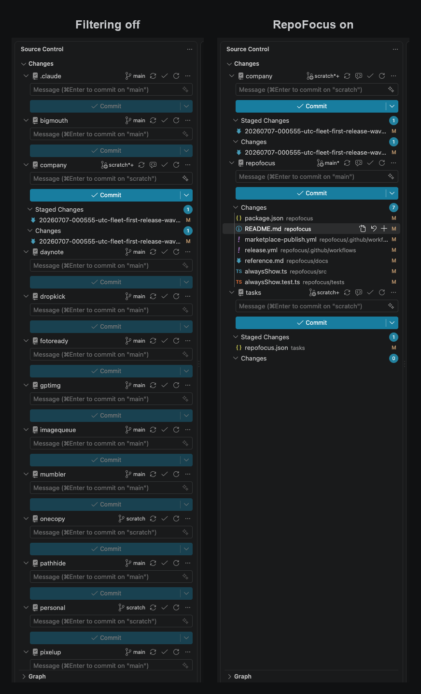

# RepoFocus

RepoFocus keeps VS Code's native Source Control view focused on Git repositories that need attention. Clean repositories disappear; repositories with conflicts, staged or unstaged changes, untracked files, a rebase, commits to push or pull, or an unpublished branch remain visible. Repository names or paths can also be pinned with one `alwaysShow` setting.

It filters the Source Control view you already use rather than replacing it with a dashboard. Hidden repositories remain open and monitored by VS Code's built-in Git extension, so a local edit or a Git-state update makes an actionable repository reappear with its normal commit box, change groups, and commands.

RepoFocus is deliberately opinionated: installing it delegates per-repository visibility to the extension. When filtering initializes or repository topology changes, RepoFocus reveals the native list, identifies its repositories, and applies the filter again. It does not fetch, run Git commands, inspect file contents, or manage VS Code's autofetch policy.



## Install

RepoFocus is on the [Visual Studio Marketplace](https://marketplace.visualstudio.com/items?itemName=nao7sep.repofocus). Open the Extensions view, search for **RepoFocus**, and install it—or run:

```sh
code --install-extension nao7sep.repofocus
```

Every release also attaches a `.vsix` and SHA-256 digest to [GitHub Releases](https://github.com/nao7sep/repofocus/releases/latest). Install one with **Extensions → … → Install from VSIX…**.

Filtering turns on automatically after VS Code starts, whether Source Control is already open or you open it later. Use **RepoFocus: Toggle Filtering** from the Command Palette or the filter button in the Source Control title bar to disable it for the current workspace until you turn it back on.

## Requirements

- VS Code 1.131.0 or newer on the desktop, with the built-in Git extension enabled.
- A trusted local workspace. Virtual and untrusted workspaces are unsupported.
- At least two Git repositories. A single-repository workspace is left visible.
- Git must be the only Source Control provider in the window. RepoFocus pauses instead of guessing when native visibility commands also cover a provider it cannot identify.

Incoming and outgoing status is whatever the built-in Git extension currently reports. VS Code autofetch, a manual Git fetch, or another tool may update that state; RepoFocus never does so itself.

To build from source, use Node.js 22 or newer and npm.

## Compatibility and safety

VS Code does not expose repository visibility through its public extension API, so RepoFocus uses bounded built-in Source Control commands. It activates after VS Code finishes starting. Initialization waits for the built-in Git scan, makes every provider visible, and maps opaque visibility commands in linear work: `3N−3` reversible toggles for `N` repositories, plus the final filter. The release test exercises 50 repositories opened in scrambled order.

Built-in Git activation has a 10-second bound, every native command and repository-focus transition has a 10-second bound, and complete mapping has a 120-second bound. Lazy command registration gets one five-second overall deadline, including host-call time and retry spacing; while Source Control remains unopened, a slow bounded registry check continues until its native commands appear. There are no periodic repository audits, background fetches, or window-focus jobs. Normal Git-state events only schedule visibility work when a repository changes between clean and actionable.

If VS Code's internal behavior does not match the validated contract, RepoFocus stops filtering. It restores confirmed hides through their known command ledger. A rejected toggle has an ambiguous outcome, so RepoFocus never retries that inversion: it waits for the native command to settle, re-establishes the all-visible selection-mode baseline, and remains stopped. If the native command never settles, RepoFocus reports that visibility is unknown instead of issuing more toggles. It never closes a repository. An unavailable or inconsistent Git state is treated as actionable so uncertainty remains visible.

RepoFocus owns native repository visibility while filtering is active. Do not also hide repositories with VS Code's native menu; turn RepoFocus filtering off first if you want manual control. A topology change or **RepoFocus: Refresh** from a paused state establishes a fresh all-visible baseline and intentionally discards prior per-repository visibility choices.

## Documentation

[docs/reference.md](docs/reference.md) describes actionability, the `alwaysShow` setting, commands, visibility initialization, diagnostics, and recovery.

## License

MIT © 2026 Yoshinao Inoguchi

## Contact

Yoshinao Inoguchi — yoshinao@inoguchi.com — <https://inoguchi.com>

Questions, bug reports, and feature requests belong in [GitHub Issues](https://github.com/nao7sep/repofocus/issues). For anything security-related, e-mail instead of opening an issue, and redact real repository paths, remote URLs, and branch names—a synthetic reproduction is enough.
