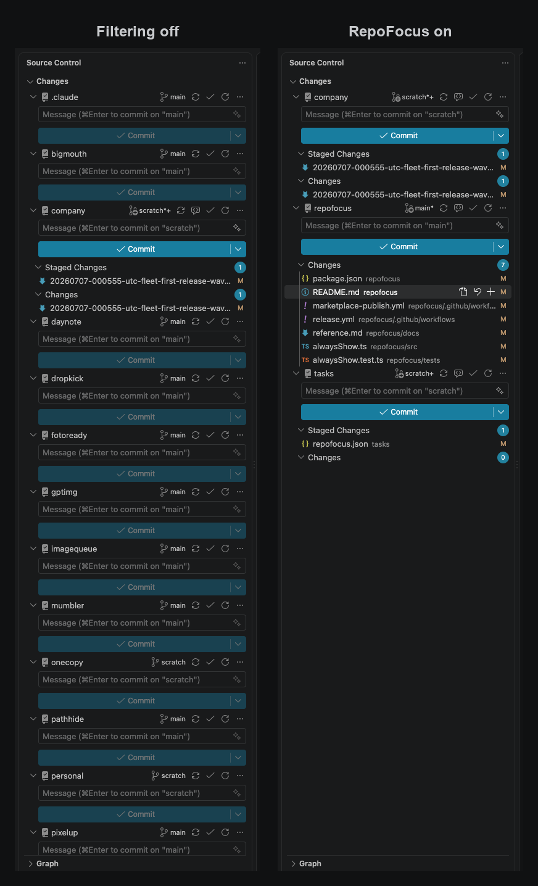

# RepoFocus

Show only the Git repositories that need attention in VS Code's Source Control view. Clean repositories disappear; repositories with conflicts, local changes, untracked files, an active rebase, commits to push or pull, or an unpublished branch remain visible. Selected repository names or paths can also stay visible through one `alwaysShow` setting.

It filters the Source Control view you already use rather than replacing it with a dashboard. Hidden repositories remain open and monitored by VS Code's built-in Git extension, so a local edit or Git-state update makes an actionable repository reappear with its normal commit box, change groups, and commands.

RepoFocus is deliberately opinionated: installing it delegates per-repository visibility to the extension while filtering is enabled. It never fetches, runs Git commands, inspects file contents, or changes VS Code's autofetch policy.



## Install

RepoFocus is on the [Visual Studio Marketplace](https://marketplace.visualstudio.com/items?itemName=nao7sep.repofocus). Open the Extensions view, search for **RepoFocus**, and install it—or run:

```sh
code --install-extension nao7sep.repofocus
```

Every release also attaches a `.vsix` and SHA-256 digest to [GitHub Releases](https://github.com/nao7sep/repofocus/releases/latest). Install one with **Extensions → … → Install from VSIX…**.

Filtering turns on automatically after VS Code starts, whether Source Control is already open or you open it later. Use **RepoFocus: Toggle Filtering** from the Command Palette or the filter button in the Source Control title bar to disable it for the current workspace until you turn it back on.

## Requirements

- VS Code 1.131.0 or newer on the desktop, with the built-in Git extension enabled.
- A trusted local workspace. Virtual and untrusted workspaces are unsupported.
- At least two Git repositories. A single-repository workspace is left visible.
- Git must be the only Source Control provider in the window. RepoFocus pauses instead of guessing when native visibility commands also cover a provider it cannot identify.

Incoming and outgoing status is whatever the built-in Git extension currently reports. VS Code autofetch, a manual Git fetch, or another tool may update that state; RepoFocus never does so itself.

To build from source, use Node.js 22 or newer and npm.

## What stays visible

A repository remains visible when RepoFocus observes any of these conditions:

- merge conflicts;
- staged, unstaged, or untracked changes;
- a rebase in progress;
- incoming or outgoing commits;
- a named branch with no upstream when the repository has a remote;
- a match in `repofocus.alwaysShow`; or
- an evaluation error or inconsistent state.

A detached HEAD, unborn branch, or local-only branch is not remote work by itself. Uncertain state remains visible.

The `repofocus.alwaysShow` setting accepts Git repository glob patterns. A pattern matches either the path VS Code reports for a repository or its directory name. Matching ignores upper and lower case on Windows and macOS, and is exact on Linux. Useful examples include `company`, `clients/*`, and `experiments/**`. A bare directory name is the most portable way to match a repository that is itself a multi-root workspace folder; use a longer path when repositories with the same directory name should differ.

## Commands

- **RepoFocus: Toggle Filtering** disables filtering and restores repositories hidden by RepoFocus, or enables filtering again. The choice is stored per workspace; if VS Code can't save it, filtering still changes and RepoFocus warns that the choice may not be remembered after you reload the window.
- **RepoFocus: Refresh** rereads `alwaysShow`, reevaluates the Git state VS Code already holds, and retries paused initialization. It does not fetch or run Git status.
- **RepoFocus: Copy Diagnostics** copies versions, aggregate counts, Git state, mapping state, and the `alwaysShow` pattern count. It excludes repository paths, remote URLs, branch names, file names, file contents, and error details.

## Compatibility and safety

VS Code does not expose repository visibility through its public extension API, so RepoFocus uses bounded built-in Source Control commands. It establishes a known all-visible baseline, identifies which native command belongs to each Git repository without assuming provider order, and then hides only clean repositories. Repository changes are handled from VS Code's Git-state events; there is no periodic audit, background fetch, or window-focus job.

If VS Code's internal behavior no longer matches the validated contract, RepoFocus stops filtering and restores every confirmed hide it owns. A failed native toggle has an ambiguous outcome, so RepoFocus does not retry the inversion or issue competing commands; it attempts a known all-visible reset and reports any visibility it still cannot determine. An unavailable or inconsistent Git state remains visible.

RepoFocus owns native repository visibility while filtering is active. Do not also hide repositories with VS Code's native menu; turn RepoFocus filtering off first if you want manual control. A repository-topology change or **RepoFocus: Refresh** from a paused state establishes a fresh all-visible baseline and intentionally discards prior manual visibility choices.

VS Code has no direct all-visible operation, so each visibility reset briefly sets `scm.repositories.selectionMode` to `single` and then back to `multiple`, in your user settings or, when a workspace sets that value itself, in its `.vscode/settings.json` or `.code-workspace` file. Settings Sync sees a user-settings change, and every open VS Code window without its own workspace value follows it, which resets hand-chosen repository visibility in those windows too. A window running RepoFocus takes another window's reset as its new all-visible baseline and filters again without a reset of its own, so open windows do not keep resetting one another.

RepoFocus reads only the branch, upstream, ahead/behind, rebase, and change-count state exposed by VS Code's built-in Git extension. It stores the filtering choice in per-workspace extension storage, writes no repository files other than that workspace selection-mode value, holds no credentials, and writes aggregate diagnostics to the clipboard only when requested.

## Recovery

If filtering is paused because repositories are still loading, Source Control commands are not registered, or another provider is present, leave Source Control open and run **RepoFocus: Refresh** after the condition changes.

If RepoFocus reports a compatibility failure, run **RepoFocus: Copy Diagnostics** and reload the VS Code window. If repositories stay hidden after the failure, run **RepoFocus: Toggle Filtering** from the Command Palette to turn filtering off, which tries again to show every repository. Report a repeatable failure with the copied diagnostics and a synthetic workspace; real repository paths, remote URLs, branch names, and file contents are unnecessary.

Disabling or uninstalling RepoFocus leaves the repositories it hid hidden: VS Code stops running an extension's commands before the extension stops, so nothing can re-show them at that point. VS Code remembers hidden repositories per workspace, so they also stay hidden after a reload in which RepoFocus does not filter, such as while another Source Control provider is present or after a compatibility failure. Show them again by selecting them in the Source Control Repositories view. If a native command never settles, RepoFocus stops issuing visibility commands and reports the unknown state rather than guessing.

Questions, bug reports, and feature requests belong in [GitHub Issues](https://github.com/nao7sep/repofocus/issues). For anything security-related, e-mail instead of opening an issue.

## Development

Install dependencies with `npm install`. `npm test` runs the type and unit-test gate; `npm run test:integration` builds the extension and exercises its supported workspace shapes in a real VS Code Extension Host. `npm run vscode:prepublish` runs the shipping-path check and production build.

## License

[GNU GPL v3 or later, with a narrow VS Code host exception](LICENSE) © 2026 Yoshinao Inoguchi

## Contact

- **Name:** Yoshinao Inoguchi
- **GitHub:** [@nao7sep](https://github.com/nao7sep)
- **Email:** [yoshinao@inoguchi.com](mailto:yoshinao@inoguchi.com)
- **Website:** [inoguchi.com](https://inoguchi.com)
